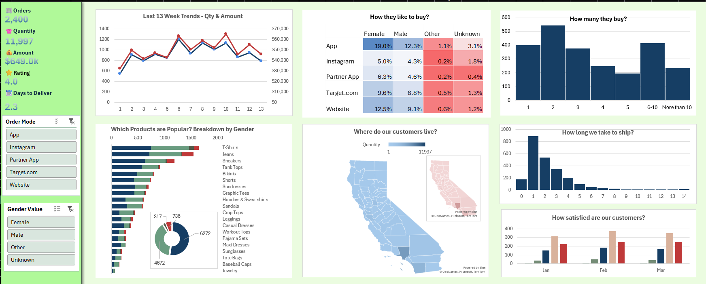

# E-Commerce Sales Dashboard (Microsoft Excel)

## Project Overview

This project is an interactive E-Commerce Sales Dashboard built entirely in Microsoft Excel to analyze sales performance, customer behavior, product trends, and operational metrics.

The dashboard enables users to explore business performance through dynamic visualizations, KPI cards, slicers, pivot tables, heatmaps, and geographical analysis.

This project demonstrates practical Excel skills commonly used in Business Analytics and Product Analytics roles.

---

## Objectives

- Analyze overall sales performance
- Track weekly sales and quantity trends
- Identify the most popular product categories
- Understand customer purchasing behavior
- Compare purchase channels across genders
- Analyze customer ratings
- Monitor delivery performance
- Visualize sales geographically

---

## Dataset

The dashboard is built using an E-Commerce transaction dataset containing **2,400 customer orders**.

### Key Fields

- Transaction ID
- Order Date
- Product Category
- Quantity
- Sales Amount
- Customer Gender
- Order Channel
- Customer Rating
- Delivery Time
- State
- County

---

## Dashboard KPIs

The dashboard highlights the following business metrics:

| KPI | Value |
|------|--------|
| Total Orders | 2,400 |
| Total Quantity Sold | 11,997 |
| Total Revenue | $649K |
| Average Customer Rating | 4.0 |
| Average Delivery Time | 2.3 Days |

---

## Dashboard Features

### KPI Cards
- Total Orders
- Total Quantity
- Revenue
- Average Rating
- Average Delivery Time

### Interactive Slicers
- Order Mode
- Customer Gender

### Visualizations

- 13-Week Sales & Quantity Trend
- Preferred Purchase Channel by Gender (Heatmap)
- Order Size Distribution
- Top Selling Products by Gender
- Sales Distribution by County (Map)
- Delivery Time Distribution
- Monthly Customer Rating Distribution

---

## Business Insights

- App purchases contribute the largest share of customer orders.
- Female customers account for a higher proportion of purchases than other customer groups.
- Most customers purchase 2 items per order.
- T-Shirts and Jeans are the highest-selling product categories.
- Average customer rating remains close to 4 throughout the observed period.
- Most orders are delivered within 2–3 days.
- Sales are concentrated in major California counties.

---

## Excel Skills Demonstrated

- Pivot Tables
- Pivot Charts
- Interactive Dashboard Design
- Slicers
- Conditional Formatting
- Heatmaps
- Map Charts
- Doughnut Charts
- Combo Charts
- Bar Charts
- Column Charts
- Data Cleaning
- Data Aggregation
- KPI Dashboard Design
- Number Formatting
- Workbook Organization

---

## Workbook Structure

```
Dashboard
Raw_Data
Dashboard_Calculations
Pivot_Product_Gender
Pivot_Heatmap_Order_Mode
Pivot_Geography_Quantity
Pivot_Geography_Revenue
Pivot_Items_Per_Order
Pivot_Monthly_Ratings
```

---

## Dashboard Preview




**Kanishka Rani**

If you found this project useful, feel free to ⭐ the repository.
